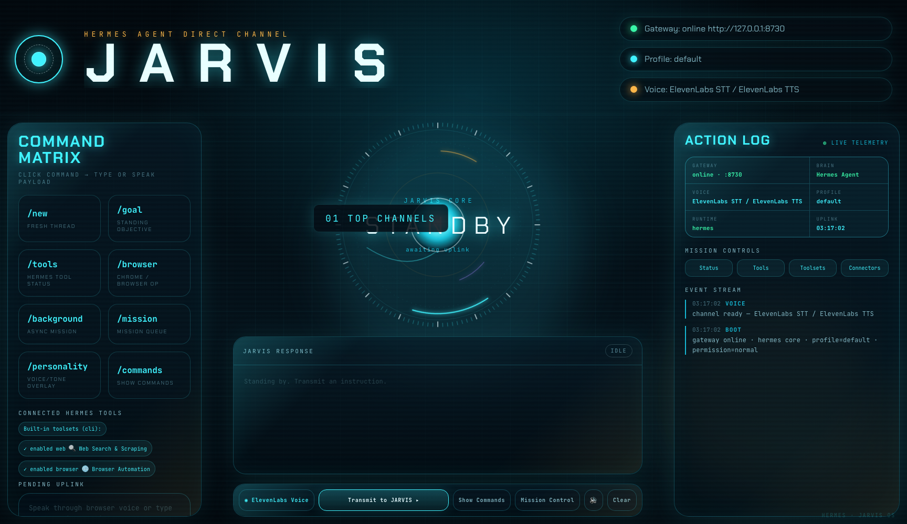

# JARVIS · Hermes Agent Mission Control

A local, voice-enabled JARVIS dashboard for [Hermes Agent](https://github.com/NousResearch/hermes-agent). It is a visual interface over your existing Hermes profile—not a second agent runtime—so it inherits the same tools, skills, memory, browser automation, MCP servers, and third-party integrations.



## What you get

- Futuristic browser-based mission-control HUD
- Natural conversational replies with a concise JARVIS voice persona
- Continuous voice conversation: listen → transcribe → answer → speak → listen
- Optional ElevenLabs speech-to-text and text-to-speech
- Browser speech fallback when ElevenLabs is not configured
- Working command matrix and slash commands
- Hermes session continuity across voice turns
- Access to the active Hermes profile's tools, skills, browser, memory, and MCP integrations
- Local-only HTTP server bound to `127.0.0.1`

## Prerequisites

1. macOS or Linux with Python 3 and a modern Chromium browser.
2. Hermes Agent installed and configured:

```bash
curl -fsSL https://hermes-agent.nousresearch.com/install.sh | bash
hermes setup
```

Confirm that `hermes chat -q "Say online"` works before installing the dashboard.

## One-command install

```bash
git clone https://github.com/Itsme23476/jarvis-hermes-dashboard.git && \
cd jarvis-hermes-dashboard && \
./install.sh
```

The installer creates a private `.env` file, starts the dashboard, and opens:

<http://127.0.0.1:8730>

No API keys are required for the basic dashboard. Browser speech APIs are used as a fallback.

## One-prompt installation with Hermes

Give this prompt to an already-installed Hermes Agent:

> Install and launch the JARVIS dashboard from https://github.com/Itsme23476/jarvis-hermes-dashboard. Clone or update it under ~/jarvis-hermes-dashboard, preserve any existing private .env file, run its installer, verify http://127.0.0.1:8730/api/status reports the Hermes runtime, and tell me the local dashboard URL. Do not print or expose any credentials.

Hermes can perform the clone, setup, launch, and health check with its terminal tools.

## Voice setup

Voice works without configuration when the browser provides SpeechRecognition and speechSynthesis. For more reliable speech, add an ElevenLabs key to the private `.env` file:

```bash
ELEVENLABS_API_KEY=your_private_key
ELEVENLABS_VOICE_ID=JBFqnCBsd6RMkjVDRZzb
ELEVENLABS_MODEL=eleven_turbo_v2_5
```

Restart the dashboard after editing `.env`. The key stays server-side and is never sent to frontend JavaScript.

## Hermes profile and tools

The dashboard uses the `default` Hermes profile unless overridden:

```bash
HERMES_PROFILE=work ./start.sh
```

If Hermes is installed at a nonstandard location:

```bash
HERMES_CMD="/absolute/path/to/hermes" ./start.sh
```

Third-party applications are connected in Hermes itself—not separately in this dashboard. Typical setup paths are:

```bash
hermes skills browse       # Gmail, Notion, Airtable, Google Workspace, etc.
hermes tools               # built-in toolsets
hermes mcp list            # external MCP servers
hermes gateway setup       # Telegram, Slack, Discord, WhatsApp, etc.
```

After changing Hermes tools or integrations, restart the dashboard or use `/new`.

## Command Matrix

Every button executes its base command immediately. Commands that accept a payload stay armed so the next typed or spoken phrase becomes `/command payload`.

| Command | Action |
|---|---|
| `/new` | Start a fresh Hermes thread |
| `/goal <text\|status\|clear>` | Set, read, or clear the standing objective |
| `/tools` | Run `hermes tools list` |
| `/browser <task>` | Ask Hermes to use its browser/Chrome tools |
| `/background <mission>` | Run a background Hermes mission |
| `/mission [task]` | Read or add to the local mission queue |
| `/personality <tone>` | Read or change the JARVIS tone overlay |
| `/commands` | Show all dashboard commands |
| `/toolsets` | Summarize enabled Hermes toolsets |
| `/connectors` | Explain integration inheritance |
| `/connect <name>` | Request Hermes-native connection guidance |
| `/status` | Show runtime/profile/voice status |

Normal text and voice requests go directly to Hermes Agent.

## Architecture

```text
Browser HUD
  ├─ microphone → browser MediaRecorder → ElevenLabs STT (optional)
  ├─ POST /api/run → Python NDJSON server
  ├─ Hermes CLI quiet mode → active Hermes profile and tools
  └─ response → ElevenLabs TTS or browser speech synthesis
```

Key files:

```text
server.py       local HTTP API and NDJSON streaming
runtime.py      Hermes CLI subprocess and session continuity
commands.py     dashboard slash commands and mission queue
voice.py        optional ElevenLabs STT/TTS proxy
persona.md      concise spoken JARVIS persona
ui/             dependency-free HTML/CSS/JavaScript HUD
install.sh      first-run setup and launch
start.sh        local launcher
```

## Security

- The server binds only to `127.0.0.1`; it is not exposed to the network.
- Every state-changing API request requires a per-launch random token, same-origin request, valid localhost host header, approved content type, and bounded request size.
- Agent runs are serialized so multiple tabs cannot race the shared Hermes session.
- Raw prompt logging is disabled unless `JARVIS_RAW_LOG` is explicitly configured; opt-in logs are created with mode `0600` and symlink protection.
- `.env`, state files, Python caches, and local credentials are ignored by Git.
- The dashboard never bundles Google, Zapier, Gmail, ElevenLabs, or Hermes credentials.
- Connected apps remain owned and authenticated by the user's Hermes profile.
- Review third-party skills and MCP servers before installing them.

## Manual start

```bash
cd ~/jarvis-hermes-dashboard
./start.sh
```

To use another port:

```bash
JARVIS_PORT=9000 ./start.sh
```

## Troubleshooting

### Hermes is not found

```bash
which hermes
hermes doctor
```

Then set `HERMES_CMD` in `.env` if needed.

### Microphone does not activate

Allow microphone access for `127.0.0.1` in the browser's site settings. ElevenLabs is optional; without it, use a browser that supports Web Speech APIs.

### A newly connected tool is missing

Start a fresh session after changing Hermes tools:

```bash
hermes tools list
```

Then restart the dashboard and click `/new`.

## Credits and license

Originally inspired by [`Itsme23476/jarvis-os`](https://github.com/Itsme23476/jarvis-os), redesigned and adapted to use Hermes Agent as its runtime. Released under the MIT License; see [LICENSE](LICENSE).
